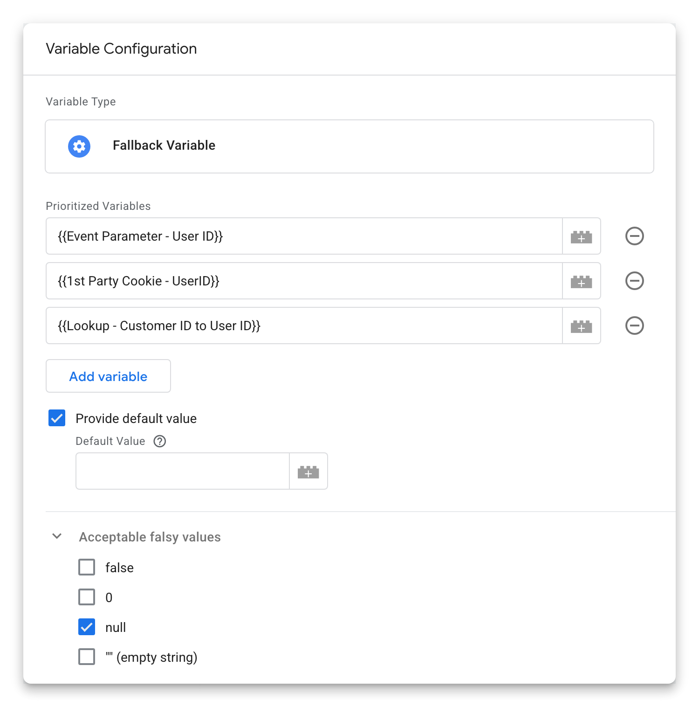

# Fallback Variable template for Google Tag Manager Server

The Fallback Variable template for Google Tag Manager Server Side allows you to define a list of variables to check in order. It returns the value of the first variable in the list that is not considered "falsy" based on standard JavaScript rules and the specified options. This is particularly useful when you need to retrieve a value from multiple potential sources and want to prioritize them.

Unlike using a LookUp Table variable for a single fallback, this template provides the flexibility to chain together an unlimited number of fallback variables, making it suitable for complex scenarios.

## How it Works

The template takes a list of Google Tag Manager variables as input. It evaluates these variables in the order they are provided. It returns the value of the first variable that is evaluated to be "truthy".

By default, the template follows standard JavaScript truthy/falsy evaluation rules, where `false`, `0`, `null`, `undefined`, and `""` (empty string) are considered falsy. However, the template offers granular control over which of these falsy types should be accepted as a valid value through specific configuration options.

If none of the variables in the list evaluate to a truthy value (based on the default rules and your specified exceptions), the template will return `undefined`. But you can provide another default value if necessary.
Optionally, if the "Provide default value" checkbox is checked, it will return the specified default value instead of `undefined`.

## Fields

*   **Prioritized Variables (list):** Add the variables you want to check in order. The template will evaluate these variables from top to bottom.
*   **Provide default value (checkbox):** If checked, and all variables in the "Variables to Check" list evaluate to a falsy value (based on the acceptance criteria), the value entered in the "Default Value" field will be returned.
    *   **Default Value (textfield):** Enter the value to return if "Provide default value" is checked and all fallback variables are falsy. If "Provide default value" is checked and this field is left empty, an empty string `""` will be returned as the default value.
*   **Accept falsy values (checkboxes):** These options allow you to control whether certain "falsy" values should be accepted as valid (i.e., not skipped over as a fallback).
    *   **`false`:** If checked, the boolean value `false` will be returned if encountered.
    *   **`0`:** If checked, the number `0` will be returned if encountered. This checkbox has no affect on numeric strings such as "0", this will always evaluate truthy. It's recommended to cast numbers beforehand.
    *   **`null`:** If checked, the value `null` will be returned if encountered.
    *   **`""` (empty string):** If checked, an empty string `""` will be returned if encountered.

## Example use case: User ID variable

Let's say you have a User ID variable that comes differently depending on the source client, if it's überhaupt provided by the clients. You might want to try and retrieve the User ID in the following order of preference:

1.  From a "User ID" event parameter (`{{Event Parameter - User ID}}`).
2.  From a "UserID" cookie (`{{1st Party Cookie - UserID}}`).
3.  Calculated from another event parameter, like "customer\_id" (`{{Lookup - Customer ID to User ID}}`).

The template will first check the event parameter. If it has a valid (not falsy) value, that value is returned. If not, it will check the cookie. If the cookie has a valid value, that's returned. If neither the event parameter nor the cookie provide a valid User ID, it will then check the Lookup Table variable.

You could also specify a default value to be returned if none of these sources provide a User ID.

By using the Fallback Variable template, you can create robust and flexible variables that adapt to different data availability scenarios.
